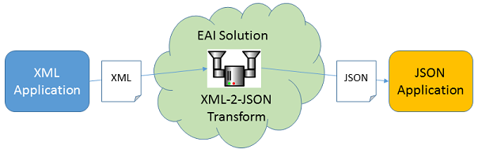

---
# You don't need to edit this file, it's empty on purpose.
# Edit theme's home layout instead if you wanna make some changes
# See: https://jekyllrb.com/docs/themes/#overriding-theme-defaults
layout: page
title: Spring Integration
icon: fa-home
order: 1
---

## Enterprise Application Integration

 

<strong>Enterprise Application Integration (EAI)</strong> is the middleware that allows applications across an Enterprise to communicate and work together.

 
<blockquote>
  
According to <em>Gartner</em>, EAI can be defined as unrestricted sharing of data and business processes among any connected application or data sources in the enterprise.

</blockquote>
 

  
### Why do we need EAI?
 
<blockquote>
  
Sometimes, Applications share data and processes that they probably weren't originally designed to share and in ways that may not have been even conceivable at the time of their creation.

</blockquote>
 

### Problem Perspective

- Producer application provide data in XML Format.
- Consumer application can only consume JSON Format data.
- EAI Solution transforms XML data to JSON data so it can be consumed.
  
   
## Spring Integration Framework
  
 
  
- There are well known solutions to common needs in EIA world, which are called **Enterprise Integration Patterns (EIP)**. EIPs can be considered as Design Patterns of EIA world.

- **Spring Integration(SI)** is a physical embodiment of the EIP in Java which is built on top of Spring Framework.

 
- With Spring Integration, you can leverage features of Spring like:
	- [x] Dependency Injection and Spring Container.
	- [x] POJO driven capabilities and Bean Wiring.
	- [x] AOP
	- [x] Spring Security
	- [x] Other benefits of Spring Ecosystem
   	
 

## Getting Starter

- You can download the starter code from <a href="https://github.com/cignextraining/si-starter/archive/master.zip">here</a>
- Alternatively, you can create mavenized project with following files in it to get started.

1. pom.xml (To be created in the root folder of project)



2. Application.java (To be created inside src/main/java/ with package /com/cd/spring/. Full Path: src/main/java/com/cd/spring/Application.java)



3. integration.xml (To be created inside src/main/resources with a directory int-config. Full Path: src/main/resources/int-config/integration.xml)

